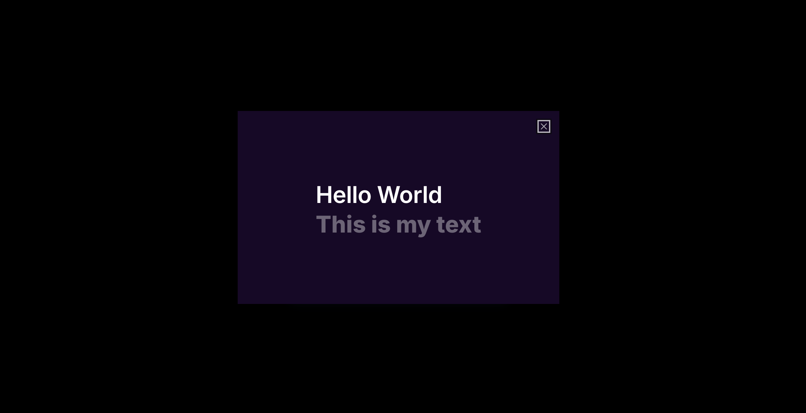

# Hello World

This is a Hello World web application that displays a text provided as an environment variable.

Used as an example to show how an open source application can be made available as software as a service in Open Source Cloud. When made available in Open Source Cloud a user can create their own instance of this application with their configuration provided via environment variables.

## Technologies Used

The app was based on a template for creating applications using Next.js 14 (app directory) and NextUI (v2).

- [Next.js 14](https://nextjs.org/docs/getting-started)
- [NextUI v2](https://nextui.org/)
- [Tailwind CSS](https://tailwindcss.com/)
- [Tailwind Variants](https://tailwind-variants.org)
- [TypeScript](https://www.typescriptlang.org/)
- [Framer Motion](https://www.framer.com/motion/)
- [next-themes](https://github.com/pacocoursey/next-themes)

## How to Use

### Install dependencies

You can use one of them `npm`, `yarn`, `pnpm`, `bun`, Example using `npm`:

```bash
npm install
```

### Run the development server

```bash
TEXT="This is my text" npm run dev
```


## License

Licensed under the [MIT license](https://github.com/nextui-org/next-app-template/blob/main/LICENSE).
